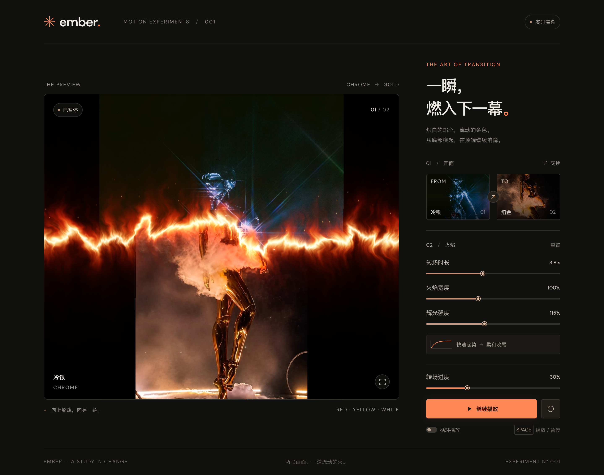

# EMBER · 火焰转场

Next.js + TypeScript + 原生 WebGL 的图片过场实验。两张用户提供的原图已经放在 `public/images/`。



## 运行

```bash
cd /Users/lavendashan/Documents/ember-transition
npm install
npm run dev
```

打开 http://localhost:3017 。项目默认使用 3017 端口。

```bash
npm run typecheck
npm run build
npm start
```

`npm start` 用于运行构建后的生产版本；请先停止占用同一端口的开发服务器。

## 操作

- 首次加载后自动播放一次；系统启用“减少动态效果”时等待手动播放。
- 播放／暂停：按钮或空格。重播：右侧重播按钮或 `R`。
- 拖动“转场进度”可逐段查看并暂停火焰。点击图片缩略图可查看对应端点。
- 时长、火焰宽度、焰心宽度和辉光强度实时生效。“焰心宽度”单独调节最亮白色条带的粗细（20%–300%）。“重置”恢复四个参数的默认值。
- “交换”切换图片先后顺序；火焰始终从底部向顶部运动。
- “循环播放”在每次完成后停留 1.3 秒，再交换前后图进行下一次过场。
- 预览右下角进入全屏，支持桌面和移动端布局。

## 效果实现

- 单次 WebGL 绘制同时采样两张图片，用同一条扰动边界完成遮罩与火焰渲染。
- `1 - (1 - progress)^2.4` 提供快速起势、顶部缓慢减速的运动曲线。末尾逐渐消隐，端点直接输出原图。
- 多层分形噪声、域扭曲和向上平移的噪声产生不规则火焰带，叠加红色外焰、金黄火身、黄白焰心、局部热折射与稀疏余烬。
- 图片采用 contain 适配，完整保留原图比例与人物；两张图比例不同，边缘会出现黑色留白。
- 暂停或结束后停止动画帧循环；切到后台不推进时间。设备像素比上限为 1.6，减少高分辨率屏幕的着色开销。
- 纹理、缓冲区、程序、监听器及计时器随组件销毁清理；WebGL 上下文恢复后重新创建渲染器。

## 主要文件

- `components/flame-studio.tsx`：交互、播放状态与页面。
- `lib/flame-renderer.ts`：WebGL 初始化、原图纹理、尺寸适配与资源清理。
- `lib/flame-shaders.ts`：火焰、混合遮罩、颜色、热扰动与运动曲线。
- `app/globals.css`：响应式界面。

素材为本次提供的原图。私有源码仓库：[SummonLav/ember-transition](https://github.com/SummonLav/ember-transition)。
