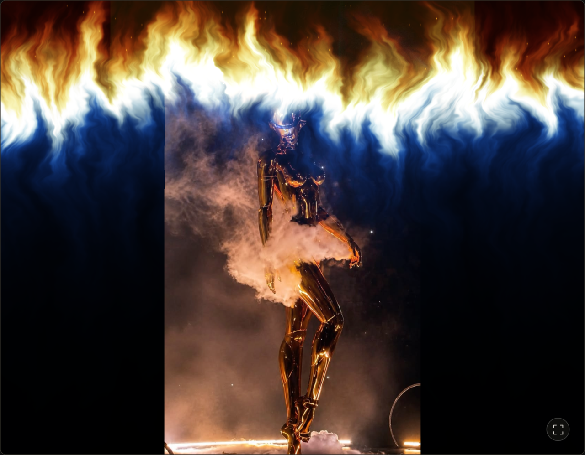

# Only Burn Through

[English](README.md) · **简体中文**

火焰转场与磨损字体效果，Only 系列中的一款小工具。

## 先用 Skill

附上演唱会视频，把这段话粘贴到 Codex：

```text
安装 https://github.com/SummonLav/only-burn-through/tree/main/skills/theweeknd-highlights 中的 skill，然后用 $theweeknd-highlights 把我的素材剪成 45 秒竖屏高光，使用火焰转场，保留现场原声，不加字幕。
```

安装后，直接让 `$theweeknd-highlights` 剪辑下一组素材。默认 **45 秒 · 720 × 1280 · 30 fps · 不加字幕**；需要重音歌名时明确提出即可。

视频在本地处理，需要 Python 3、Node.js、FFmpeg/FFprobe，以及 Chrome 或 Playwright Chromium。Skill 会安装自身的 Python 与 Node 依赖。[Skill 说明](skills/theweeknd-highlights/SKILL.md) · [配置说明](skills/theweeknd-highlights/references/configuration.md)

## 在线体验

[**打开工作台 →**](https://only-burn-through.vercel.app)

- **[火焰转场](https://only-burn-through.vercel.app)：** 拖动进度、重播，调整时长、火焰宽度、焰心宽度和辉光。
- **[字体效果](https://only-burn-through.vercel.app/typography)：** 编辑红色模板字形，调整磨损与信号错位，导出透明 PNG。
- **[字焰开场](https://only-burn-through.vercel.app/opening)：** 标题被火焰烧散，露出下一张画面。

网页默认英文，点击页头「中文」即可切换。无需账号或 API Key。网页用于预览效果，Skill 用于剪辑本地视频。



## 示例

**火焰转场 · 无字幕（默认）** — 45 秒，现场原声，烟花收尾。

https://github.com/user-attachments/assets/05bc28b8-9e71-43b9-bded-33a23b5897cf

<details>
<summary>字体效果与可选歌名字幕</summary>

**字体效果** — 6 秒红色磨损字形。

https://github.com/user-attachments/assets/369d4c6f-e119-482d-adf6-df0ecbbdd9f9

**带歌名字幕** — 45 秒，重音处显示歌名。

https://github.com/user-attachments/assets/a184b2df-3938-49c5-a301-4005ed6353c4

</details>

## 本地运行

```sh
git clone https://github.com/SummonLav/only-burn-through.git
cd only-burn-through
npm ci
npm run dev
```

打开 [localhost:3017](http://localhost:3017)。使用 Next.js、TypeScript、WebGL 与 GSAP。空格播放或暂停，R 重播火焰转场和开场动画；支持系统「减少动态效果」偏好。

<details>
<summary>手动安装 Skill 与开发检查</summary>

在克隆的仓库中，将独立 Skill 复制到 Codex 技能目录：

```sh
mkdir -p "${CODEX_HOME:-$HOME/.codex}/skills"
cp -R skills/theweeknd-highlights "${CODEX_HOME:-$HOME/.codex}/skills/"
```

使用[示例配置](skills/theweeknd-highlights/references/the-weeknd-example.json)时，将视频路径替换为自己的素材路径。

```sh
npm run typecheck
npm run build
```

</details>
